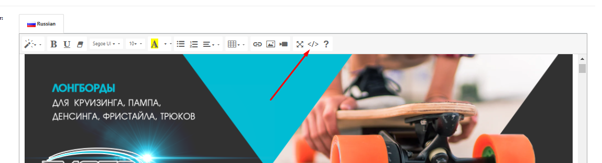
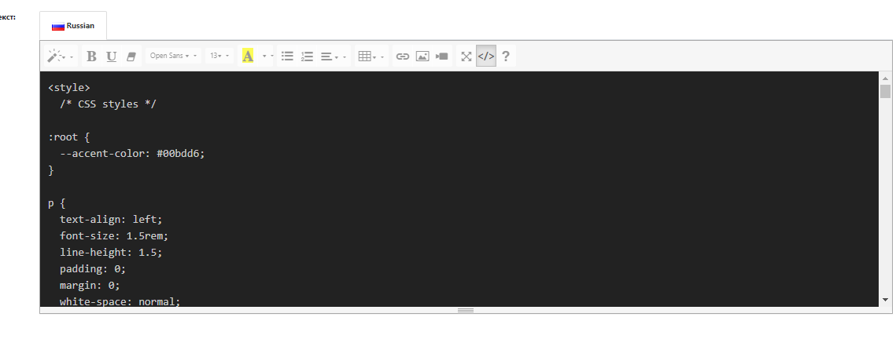

 # **Гайд по шаблону для посадочных страниц**

**Шаблон основан на сетке Bootstrap**

C [документацией по Bootstrap](https://bootstrap-5.ru/docs/5.3/layout/grid/) можно ознакомиться на официальном сайте. 

Шаблон можно найти по [ссылке](https://github.com/valikkirov/wso/blob/main/Template.html)

----

>В начале необходимо загрузить все необходимые графические элементы на сайт при помощи менеджера изображений. Название картинок необходимо писать на латинице. Откройте отдельно какой нибудь редактор кода и собирайте блоки там. Если собираете код в редакторе OpenCart, не забывайте постоянно сохраняться. Можно использовать сервис https://codepen.io.

*1) Для того чтобы начать собирать посадочную страницу, необходимо вставить стили. В шаблоне начало и конец стилей помечены комментариями:*

        <!-- Начало стилей -->

        <!-- Конец стилей -->

> Для удобства в шаблоне закоментированы все блоки

Копируем код, который находится между комментариями и всавляем редактор OpenCart переключившись на вкладку "Исходный код".

Вставляем код

Не забываем сохраняться.

*2) Для удобства шаблон разбит на блоки. В заисимости от дизайна и структуры, вставляются необходимые блоки. Блоки можно вставлять из гайда, они представлены в виде кода или из самого шаблона.* 

2.1) Баннер картинка на всю ширину.

    <!-- Блок баннер картинка на всю ширину. -->
    

        

            

            
            

        

    

    <!-- Конец блока -->

Для того чтобы подставить свою картинку, в строке 

        

Между ковычками "" прописываем адрес нужной картинки. Например: https://product-wso.ru/image/catalog/img/img-design/text.png 

Просмотр блока в live режиме в Codepen: https://codepen.io/qbqgigys-the-looper/pen/rNQKGOL